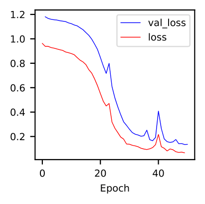

.. _usage:

Usage
-----

.. _install:

Install
^^^^^^^

To use ``disperseNN2``, we recommend first creating a new conda environment for staying organized:

.. code-block:: console

		(.venv) $ conda create -n disperseNN2 python=3.9 --yes

Then inside the conda env, install ``disperseNN2`` using pip (NOT YET LIVE; for now: ``pip install -r requirements/development.txt``):

.. code-block:: console

                (.venv) $ conda activate disperseNN2		
		(.venv) $ pip install disperseNN2

``disperseNN2`` should run fine on a CPU. For using GPUs it is necessary to install additional software. We use the below commands to set things up on our computer. However, note that tensorflow and cuda versions must be compatible with your particular `NVIDIA drivers <https://www.tensorflow.org/install/source#gpu>`_. Therefore, the below commands will not work in every case and you may need to improvise (some commands must be run individually, so don't copy the whole code block.)

.. code-block:: console

		(.venv) $ mamba install cudatoolkit=11.8.0 cuda-nvcc -c conda-forge -c nvidia
		(.venv) $ python3 -m pip install nvidia-cudnn-cu11==8.6.0.163 tensorflow==2.12.*
                (.venv) $ mkdir -p $CONDA_PREFIX/bin/nvvm/libdevice/
                (.venv) $ cp $CONDA_PREFIX/nvvm/libdevice/libdevice.10.bc $CONDA_PREFIX/bin/nvvm/libdevice/		
		(.venv) $ mkdir -p $CONDA_PREFIX/etc/conda/activate.d
                (.venv) $ echo 'export XLA_FLAGS=--xla_gpu_cuda_data_dir=$CONDA_PREFIX/bin/' >> $CONDA_PREFIX/etc/conda/activate.d/env_vars.sh		
		(.venv) $ source $CONDA_PREFIX/etc/conda/activate.d/env_vars.sh
		(.venv) $ python3 -c "import tensorflow as tf; print(tf.config.list_physical_devices('GPU'))" # verify that gpus get picked up

Workflow
^^^^^^^^
This section describes the command line flags associated with each step in the workflow; for a complete, worked example, see :doc:`vignette`.

A typical ``disperseNN2`` workflow involves five steps:

.. While it might be possible to run smaller tests on a laptop, it is generally advisable to seek out a high performance computing cluster, particularly for the simulation step.                                                                                                                                                     

:ref:`simulation`
   
:ref:`preprocessing`

:ref:`training`

:ref:`validation`

:ref:`empirical`

     

.. _simulation:

*************   
1. Simulation
*************

Although ``disperseNN2`` is not used for running simulations, it relies on simulated training data. Therefore, we provide some template code for generating training data. Hhowever, the ideal analysis will tailor the simulation step to take advantage of realistic information from your particular study system. For information on how to implement population genetic simulations, check out the `SLiM manual <http://benhaller.com/slim/SLiM_Manual.pdf>`_.

The simulation script we use to train ``disperseNN2`` is ``SLiM_recipes/square.slim``. This is a continuous space model where the mother-offspring distance is :math:`N(0,\sigma)` in both the :math:`x` and :math:`y` dimensions. Other details of the model are described in `Battey et al. 2020 <https://doi.org/10.1534/genetics.120.303143>`_. Below is an example simulation command. First activate the conda env and also install ``SLiM``:

.. code-block:: console

		(.venv) $ conda activate disperseNN2

.. code-block:: console

                (.venv) $ mamba install slim==4.0.1 -c conda-forge

.. code-block:: console

		(.venv) $ conda activate disperseNN
		(.venv) $ mkdir -p temp_wd/TreeSeqs
		(.venv) $ slim -d SEED=12345 \
                >              -d sigma=0.2 \     
		> 	       -d K=10 \
		>	       -d r=1e-8 \
		>	       -d W=50 \
		>	       -d G=1e8 \
		>	       -d maxgens=1000 \
		>	       -d OUTNAME="'temp_wd/TreeSeqs/my_sequence'" \
		>	       SLiM_recipes/square.slim \
		>	       # Note the two sets of quotes around the output name
		
Command line arguments are passed to ``SLiM`` using the ``-d`` flag followed by the variable name as it appears in the recipe file.

- ``SEED``: a random seed to reproduce the simulation results.
- ``sigma``: the dispersal parameter.
- ``K``: carrying capacity. Note: the carrying capacity in this model, K, corresponds roughly to density, but the actual density will vary depending on the model, and will fluctuate a bit over time.
- ``r``:  per base per genertation recombination rate.
- ``W``: the height and width of the geographic spatial boundaries.
- ``G``: total size of the simulated genome.
- ``maxgens``: number of generations to run simulation.
- ``OUTNAME``: prefix to name output files.

.. note::

   The above example used only 1,000 spatial generations; this strategy should be used with caution because this can affect how the output is interpreted. In addition, isolation-by-distance is usually weaker with fewer spatial generations which reduces signal for dispersal rate. In the ``disperseNN2`` paper we ran 100,000 generations spatial.

After running ``SLiM`` for a fixed number of generations, the simulation is still not complete, as many trees will likely not have coalesced still. Next you will need to finish, or "recapitate", the tree sequences. We recommend recapitating at this early stage, before training, as training can be prohibitively slow if you recapitate on-the-fly. The below code snippet in python can be used to recapitate a tree sequence:

.. code-block:: pycon

		>>> import tskit,msprime
		>>> ts=tskit.load("temp_wd/TreeSeqs/my_sequence_12345.trees")
		>>> Ne=len(ts.individuals())
		>>> demography = msprime.Demography.from_tree_sequence(ts)
		>>> demography[1].initial_size = Ne
		>>> ts = msprime.sim_ancestry(initial_state=ts, recombination_rate=1e-8, demography=demography, start_time=ts.metadata["SLiM"]["cycle"],random_seed=12345)
		>>> ts.dump("temp_wd/TreeSeqs/my_sequence_12345_recap.trees")

.. note::

   Here, we have assumed a constant demographic history. If an independently inferred demographic history for your species is available, or if you want to explore different demographic histories, the recapitation step is a good place for implementing these changes. For more information see the `msprime docs <https://tskit.dev/msprime/docs/stable/ancestry.html#demography>`_.

For planning the total number of simulations, consider the following. If the simulations explore a large parameter space, e.g. more than	one or two free	parameters, then larger training sets may be required.	In our paper, we used a training set of 50,000—--but, this is number may depend on the training distribution, Last, don't forget to run extra simulations (e.g., 100 or 1000) to validate your model with post training.

Simulation programs other than ``SLiM`` could be used in theory. The only real requirements of ``disperseNN2`` regarding training data are: genotypes are in a 2D array, the corresponding sample locations are in a table with two columns, and the target values are saved in individual files; all as numpy arrays. 

.. _preprocessing:

****************
2. Preprocessing
****************

The preprocessing step actually involves more simulation: it adds mutations to each tree sequence, takes a sample of individuals, and then saves the genotypes and sample locations in numpy arrays.
Doing these steps up front instaed of during training is more efficient.
In addition, multiple samples can be taken from the same tree sequence to make the training set larger.
A basic preprocessing command looks like:

.. code-block:: console
		
		(.venv) $ python disperseNN2.py \
                >                --out temp_wd/output_dir \
		>                --seed 12345 \
		>		 --preprocess \
		>                --n 10 \
		>		 --num_snps 5000 \
		>		 --tree_list Examples/tree_list1.txt \
		>		 --target_list Examples/target_list1.txt \
		>		 --empirical Examples/VCFs/halibut \
		>		 --hold_out 2

- ``--out``: output directory
- ``--preprocess``: this flag tells ``disperseNN2`` to preprocess the training data
- ``--n``: sample size
- ``--num_snps``: the number of SNPs to use as input for the CNN
- ``--tree_list``: path to a list of filepaths to the tree sequences
- ``--target_list``: path to list of filepaths to .txt files with the target values
- ``--empirical``: prefix for the empirical locations. This includes the path, but without the filetype suffix, ".locs".
- ``--hold_out``: number of tree sequences to hold out from training, to be used for testing later on (int)
- ``--seed``: random number seed

.. note::

   Simulated individuals are sampled near the empirical sample locations: a table with one row per individual, with latitude and longitude tab-separated. Our strategy involves first projecting the geographic coordinates for each location onto a 2D surface. By default, the projected locations are repositioned to new, random areas of the training map before sampling individuals from those locations; this is making the assumption that the true habitat range is unknown and we want our predictions to be invariant to the position of the sampling area within the greater species distribution.

.. Last, the spatial coordinates are rescaled to :math:`(0,1)`, preserving aspect ratio, before being shown to the neural network as input.
  
The preprocessing step can be parallelized to some extent: a single command preprocesses all simulations serially by taking one sample of genotypes from each dataset. Independent commands can be used with different random number seeds to take multiple, pseudo-independent samples from each simulation.
		
The preprocessed data are saved in the directory specified by ``--out``; other analysis outputs will also be saved in this folder.

.. _training:

***********
3. Training
***********

Below is an example command for the training step.

.. code-block:: console

		(.venv) $ python disperseNN2.py \
		>		 --out Examples/Preprocessed \
		>                --seed 12345 \
		>		 --train \
		>		 --num_snps 1951 \
		>		 --max_epochs 50 \
		>		 --validation_split 0.2 \
		>		 --batch_size 10 \
		>		 --threads 1 \
		>		 --n 10 \
		>		 --pairs 45 \
		>		 --pairs_encode 45 \
		>		 --pairs_estimate 45 \
		>		 --gpu -1 \
		>		 > temp_wd/output_dir/training_history_12345.txt

- ``--train``: tells ``disperseNN2`` to train a neural network
- ``--max_epochs``: maximum number of epochs to train for.
- ``--validation_split``: the proportion of training data held out for validation between batches for hyperparameter tuning. We use 0.2.
- ``--batch_size``: we find that batch_size=10 works well.
- ``--threads``: number of threads to use during training. 
- ``--pairs``: the total number of pairs to include in the analysis. Defaults to all pairs.
- ``--pairs_encode``: the number of pairs to include in the gradient in the encoder portion of the neural network. Default: all pairs.
- ``--pairs_estimate``: the number of pairs to include in the estimator portion of the neural network. Default: all pairs.
- ``--gpu``: as an integer, specifies the GPU index (e.g., 0, 1, etc). "any" means take any available gpu. -1 means no GPU.

This command will print the training progress to stdout.
The model weights are saved to ``<out>/Train/disperseNN2_<seed>_model.hdf5``.
In practice, you will likely want to train for longer than 10 epochs.
A single thread should be sufficient for reading preprocessed data, but we fonud that between 2 and 10 threads speeds up training. 

After training has completed (or has been interrupted), the training history can be visualized using a ``disperseNN2`` functionality:

.. code-block:: console

                (.venv) $ python disperseNN2.py --plot_history temp_wd/output_dir/training_history_12345.txt

   Plot of training history. X-axis the	training iteration, and	Y-axis is mean squared error.

		

.. _validation:

*************
4. Validation
*************

If you want to predict :math:`\sigma` from simulated data, a predict command like the below one can be used:

.. code-block:: console

		(.venv) $ python disperseNN2.py \
		>		 --out Examples/Preprocessed \
		>                --seed 67890 \
		>		 --predict \
		>		 --num_snps 1951 \
		>		 --batch_size 10 \
		>		 --n 10 \
		>		 --num_pred 10

- ``--predict``: tells ``disperseNN2`` to perform predictions
- ``--num_pred``: number of datasets to predict with.

This will generate a file called ``<out>/Test/predictions_<seed>.txt`` containing:

.. code-block:: console

		(.venv) $ cat Examples/Preprocessed/Test/predictions_67890.txt
		1.4369271974721274      1.9806803220508296
		0.9820625410339322      1.186689110171824
		1.4355382722024348      1.4655386350662676
		5.7779024313810154      2.4762330756097093
		0.42382894621819184     0.47895961668499304
		1.5875503080280997      2.4020665455934065
		3.26279380573441        2.9089088397237615
		1.1466445562606893      1.1072462108638617
		0.47409650933782926     0.6602425910881142
		0.4445415347763558      0.5027703630816823

Here, the columns list the true and predicted :math:`\sigma` for each simulation.

.. _empirical:

************************
5. Empirical prediction
************************

Finally, for predicting with empirical data, we provide the program with (1) a .vcf and (2) a .locs file (mentioned above, with preprocessing). The order of individuals in the .vcf needs to match that of the .locs file. SNPs should be minimally filtered to exclude indels, multi-allelic sites, and maybe low-confidence variant calls; however, low-frequency SNPs should be left in as these are informative about demography.

.. code-block:: console

                (.venv) $ python disperseNN2.py \
                >                --out Examples/Preprocessed/ \
		>		 --seed 67890 \		       
		>		 --predict \
		>		 --empirical Examples/VCFs/halibut \
		>		 --num_snps 1951 \
		>		 --n 10 \
		>		 --num_reps 5

- ``--empirical``: prefix for the empirical data that is shared for both the .vcf and .locs files. This includes the path, but without the filetype suffix. 
- ``--num_reps``: specifies how many bootstrap replicates to perform. Each replicate takes a random draw of num_snps SNPs from the VCF.

The output is in kilometers and can be found in ``<out>/empirical_<seed>.txt``:

.. code-block:: console

		(.venv) $ cat Examples/Preprocessed/empirical_67890.txt
		Examples/VCFs/halibut rep0 0.2743969424
		Examples/VCFs/halibut rep1 0.2441067173
		Examples/VCFs/halibut rep2 0.2532926691
		Examples/VCFs/halibut rep3 0.2990145165
		Examples/VCFs/halibut rep4 0.2740349936
