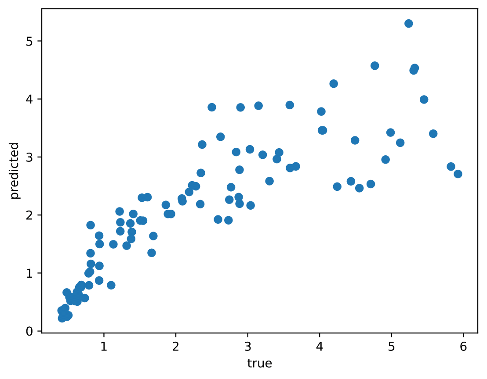

Vignette: example workflow
==========================

This vignette shows a complete pipeline for a small application of ``disperseNN2``. Some details referenced in the below vignette, e.g., descriptions of command line flags, are explained under :doc:`usage`.
We recommend using a machine with 10s of CPUs and a GPU for the below analysis.

**Table of contents:**

:ref:`vignette_simulation`

:ref:`vignette_preprocessing`

:ref:`vignette_training`

:ref:`vignette_validation`

:ref:`vignette_empirical`

     

.. _vignette_simulation:

1. Simulation
-------------
A complete workflow would include running simulations that approximate the life history and species range of a focal organism
Here we will use simulations from the ``SLiM`` package to generate training data for ``disperseNN2``. 
The simulations are use a simple model of a species with a square range and a Gaussian dispersal kernel. 
The script is included in the ``disperseNN2`` repo under ``SLiM_recipes/square.slim``. 

To start with: create a new working directory and install ``SLiM`` if you haven't yet:

.. code-block:: console

                (.venv) $ mkdir temp_wd
                (.venv) $ cd temp_wd
                (.venv) $ mamba install slim==4.0.1 -c conda-forge

For this demonstration we will analyze a population of *Internecivus raptus*. Let's assume we have independent estimates from previous studies for several parameters:

- the width of the species range is 78 km
- population density is 2.5 individuals per km\ :math:`^2`
- recombination rate is 1e-8 crossovers per bp per generation

With values for these nuisance parameters in hand we can design custom training simulations for inferring :math:`\sigma`. If our a priori expectation for :math:`\sigma` in this species is somewhere between 0.4 and 6, we will simulate dispersal rates in this range. 100 training simulations should suffice for this demonstration, plus 100 more for testing, so we need 200 total simulations.		

Navigate to the :ref:`simulation` section of the docs and copy over the ``square.slim`` script. Below is some bash code for pipelining the simulations.

.. code-block:: console                         
                :linenos:                       

                (.venv) $ mkdir -p vignette/TreeSeqs
                (.venv) $ mkdir -p vignette/Targets
		(.venv) $ sigmas=$(python -c 'from scipy.stats import loguniform; import numpy; numpy.random.seed(seed=12345); print(*loguniform.rvs(0.4,6,size=200))')
                (.venv) $ for i in {1..200}; do \
                >             sigma=$(echo $sigmas | awk -v var="$i" '{print $var}'); \
		>             echo "slim -d SEED=$i -d sigma=$sigma -d K=2.5 -d r=1e-8 -d W=78 -d G=1e8 -d maxgens=1000 -d OUTNAME=\"'vignette/TreeSeqs/output'\" square.slim" >> vignette/sim_commands.txt; \
		>             echo $sigma > vignette/Targets/target_$i.txt; \
		>             echo vignette/Targets/target_$i.txt >> vignette/target_list.txt; \
		>         done

Breaking down this pipeline one line at a time:

- L1 creates a new folder for the simulation output. The base folder ``vignette`` will contain all output from the current vignette.
- L2 creates another folder for the training targets.
- L3 draws random :math:`\sigma`\'s from a log-uniform distribution.
- L6 builds individual commands for simulations.
- L7 saves each :math:`\sigma` to it's own file.
- L8 creates a list of filepaths to the targets.

The number of simulations run in parallel can be adjusted with ``num_jobs``:

.. code-block:: console

                (.venv) $ num_jobs=1 # change to number of available cores
                (.venv) $ parallel -j $num_jobs < vignette/sim_commands.txt
  
.. note::

   The above example used only 1,000 spatial generations; this strategy should be used with caution because this can affect how the output is interpreted. In addition, isolation-by-distance is usually weaker with fewer spatial generations which reduces signal for dispersal rate. In the paper we used 100,000 spatial generations.
  
To recapitate the tree sequences output by ``SLiM``:

.. code-block:: console

		(.venv) $ for i in {1..200}; do \
		>             echo "python -c 'import tskit,msprime; \
		>                              ts=tskit.load(\"vignette/TreeSeqs/output_$i.trees\"); \
		>		               Ne=len(ts.individuals()); \
		>		               demography = msprime.Demography.from_tree_sequence(ts); \
		>		               demography[1].initial_size = Ne; \
		>		               ts = msprime.sim_ancestry(initial_state=ts, recombination_rate=1e-8, demography=demography, start_time=ts.metadata[\"SLiM\"][\"cycle\"],random_seed=$i,); \
		>		               ts.dump(\"vignette/TreeSeqs/output_$i"_"recap.trees\")'" \
		>             >> vignette/recap_commands.txt; \
		>             echo vignette/TreeSeqs/output_$i"_"recap.trees >> vignette/tree_list.txt; \
		>         done   
		(.venv) $ parallel -j $num_jobs < vignette/recap_commands.txt

		

.. _vignette_preprocessing:

2. Preprocessing
----------------

Next, we need to preprocess the input for ``disperseNN2``. But before we do that we need to clean up our *I. raptus* metadata, because we will use the empirical sampling locations during preprocessing. Go ahead and clone our git repo which contains the empirical data we're analyzing, 

.. code-block:: console

                (.venv) $ git clone https://github.com/chriscrsmith/disperseNN2.git

Let's pretend we want to take a subset of individuals from a particular geographic region, the "Scotian Shelf-East" region. Below is an example command that might be used to parse and reformat the metadata, but these steps will vary depending on the idiosyncracies of your particular dataset. 

.. code-block:: console

		(.venv) $ cat disperseNN2/Examples/VCFs/iraptus_meta_full.txt | grep "Scotian Shelf - East" | sed s/"\t"/,/g > vignette/iraptus.csv

..
 We provide a simple script for subsetting a VCF for a particular set of individuals, which also filters indels and non-variant sites:

		(.venv) $ python Empirical/subset_vcf.py disperseNN2/Examples/VCFs/iraptus_full.vcf.gz vignette/iraptus.csv vignette/iraptus.vcf 0 1 12345
		(.venv) $ gunzip vignette/iraptus.vcf.gz
 The flags for ``Empirical/subset_vcf.py`` are:

 1. path to input vcf (gzipped)
 2. path to metadata (.csv)
 3. output name
 4. minimum read depth to retain a SNP (int)
 5. minimum proportion of samples represented to keep a SNP (float)
 6. random number seed (int)
		
Last, build a .locs file:

.. code-block:: console                                                                        
                                                                                            
                (.venv) $ count=$(cat disperseNN2/Examples/VCFs/iraptus.vcf | grep -v "##" | grep "#" | wc -w) 
                (.venv) $ for i in $(seq 10 $count); do \                                       
                >             id=$(cat disperseNN2/Examples/VCFs/iraptus.vcf | grep -v "##" | grep "#" | cut -f $i); \
                >             grep -w $id vignette/iraptus.csv; \
                >         done | cut -d "," -f 4,5 | sed s/","/"\t"/g > vignette/iraptus.locs 
		   
This filtering results in 1951 SNPs from 95 individuals. These values are included in our below ``disperseNN2`` preprocessing command.
This preprocessing step will take a while (maybe an hour), so it's a good time to get some coffee:

.. code-block:: console
		
		(.venv) $ disperseNN2 \
		>             --out vignette/output_dir \
		>	      --seed 12345 \
		>	      --preprocess \
		>	      --num_snps 1951 \
		>	      --n 95 \
		>	      --tree_list vignette/tree_list.txt \
		>	      --target_list vignette/target_list.txt \
		>	      --empirical vignette/iraptus \
		>	      --hold_out 100

   

		       

.. _vignette_training:

3. Training
-----------

In the below ``disperseNN2`` training command, there are two options that bear a bit of explanation.
In the example data we are working with there are 95 individuals, and so $95 \choose 2$ = 4465 pairs of individuals.
We set ``--pairs`` to 1000 to reduce the number of pairwise comparisons used and thus the memory requirement.
Further our architecture only considers a subset of pairs on the backward pass for gradient computation, this number is chosen with ``--pairs_encode``.
 We've found that using 100 for ``--pairs_encode`` works well, and again reduces memory significantly.
Training on ~50 CPU cores will take approximately 20 minutes. If you have a GPU available, use the ``--gpu`` flag

.. code-block:: console

                (.venv) $ disperseNN2 \
		>             --out vignette/output_dir \
		> 	      --seed 12345 \
		> 	      --train \
		>             --max_epochs 100 \
		>             --validation_split 0.2 \
		>             --batch_size 10 \
		>             --learning_rate 1e-4 \
		>             --pairs 1000 \
		>             --pairs_encode 100 \
		>	      > vignette/output_dir/training_history_12345.txt

After the run completes, you can visualize the training history. This will create a plot of the training and validation loss
declining over epochs of training, 
``vignette/output_dir/training_history_12345.txt_plot.pdf``:

.. code-block:: console

                (.venv) $ disperseNN2 --plot_history vignette/output_dir/training_history_12345.txt
		
.. figure:: training_vignette.png
   :scale: 50 %
   :alt: training_plot

   Plot of training history. X-axis the training iteration, and Y-axis is mean squared error.

This plot shows that the validation loss decreases over time, without too much under- or over-fitting.
		

		       

.. _vignette_validation:

4. Validation
-------------

Next, we will validate the trained model on simulated test data. In a real application you should hold out datasets from training.

.. code-block:: console

                (.venv) $ disperseNN2 \
		>             --out vignette/output_dir \
                >             --seed 12345 \		
		>             --predict \
		>             --batch_size 10 \
		>             --pairs 1000 \
		>             --pairs_encode 100 \
		>             --num_pred 100

Below is a plot of the predictions, ``vignette/output_dir/Test/predictions_12345.txt``:
		

   Validation results. True :math:`\sigma` is on the x-axis and predicted values are on the y-axis. The dashed line is :math:`x=y`.
		       
The predictions are reasonably close to the expected values, meaning there is some signal for dispersal rate. The training run was successful.

.. However, we are currently underestimating towards the larger end of the :math:`\sigma` range. This might be alleviated by using (i) a larger training set, (ii) more generatinos spatial, (iii) larger sample size, or (iv) or more SNPs.

.. _vignette_empirical:

5. Empirical application
------------------------

Since we are satisfied with the performance of the model on the held-out test set, we can finally predict σ in our empirical data.

Before predicting with ``disperseNN2`` we need both the empirical .vcf and .locs in the same place:

.. code-block:: console
		
		(.venv) $ ln -s $PWD/disperseNN2/Examples/VCFs/iraptus.vcf vignette/

And then we can run ``disperseNN2``:
		
.. code-block:: console

		(.venv) $ disperseNN2 \
		>             --out vignette/output_dir \
                >             --seed 12345 \		
		>	      --predict \
		>	      --empirical vignette/iraptus \
		>	      --batch_size 10 \
		>             --pairs 1000 \
		>	      --pairs_encode 100 \
		>             --num_reps 10

The final empirical results are stored in: ``vignette/output_dir/empirical_12345.txt``.

.. code-block:: console

		(.venv) $ cat vignette/output_dir/empirical_12345.txt
		vignette/iraptus rep0 3.2341451032   
		vignette/iraptus rep1 3.9642933085
		vignette/iraptus rep2 3.3508346082
		vignette/iraptus rep3 3.6715345313
		vignette/iraptus rep4 3.431195108
		vignette/iraptus rep5 3.2312677469
		vignette/iraptus rep6 3.4795969837
		vignette/iraptus rep7 2.3577550127
		vignette/iraptus rep8 2.6935483629
		vignette/iraptus rep9 3.4668037613

..
		vignette/iraptus rep0 2.0451889008   # above tf 2.11, below tf 2.12?
		vignette/iraptus rep1 2.4742934411
		vignette/iraptus rep2 2.1864002565
		vignette/iraptus rep3 2.409195011
		vignette/iraptus rep4 2.4650494178
		vignette/iraptus rep5 2.2217235654
		vignette/iraptus rep6 2.3767118847
		vignette/iraptus rep7 1.6925345467
		vignette/iraptus rep8 1.8629895107
		vignette/iraptus rep9 2.302927911

		
**Interpretation**.
The output, :math:`\sigma`, is an estimate for the standard deviation of the Gaussian dispersal kernel from our training simulations; in addition, the same parameter was used for the mating distance (and competition distance). Therefore, to get the distance to a random parent, i.e., effective :math:`\sigma`,  we would apply a posthoc correction of :math:`\sqrt{\frac{3}{2}} \times \sigma` (see original disperseNN paper for details). In this example, we trained with only 100 generations spatial, hence the dispersal rate estimate reflects demography in the recent past.

