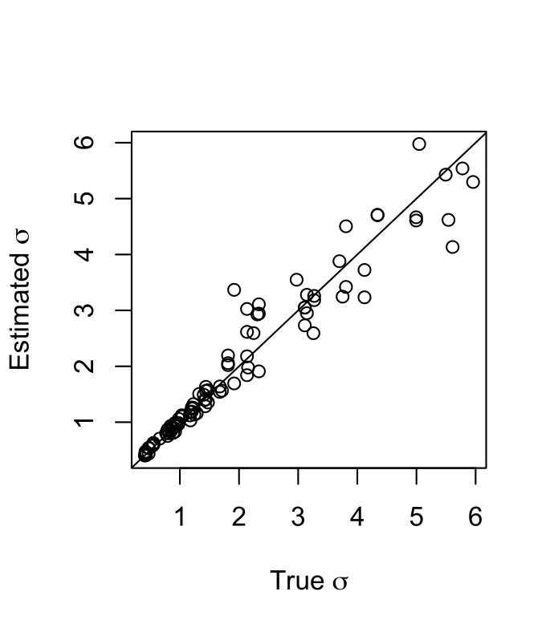

Vignette: example workflow
==========================

This vignette shows a complete pipeline for a small application of ``disperseNN2`` including instructions for the intermediate data-organizing steps. For details about individual command line flags, see :doc:`usage`.

**Table of contents:**

:ref:`vignette_simulation`

:ref:`vignette_preprocessing`

:ref:`vignette_training`

:ref:`vignette_validation`

:ref:`vignette_empirical`

     

.. _vignette_simulation:

1. Simulation
-------------

For this demonstration we will analyze a population of Internecivus raptus. Let's assume we have independent estimates from previous studies for the size of the species range and the population density: :math:`50 \times 50` km\ :math:`^2`, and 5 individuals per km\ :math:`^2`, respectively. With values for these nuisance parameters in hand we can design custom training simulations for inferring :math:`\sigma`. If our a priori expectation for :math:`\sigma` in this species is somewhere between 0.2 and 3, we will simulate dispersal rates in this range.

Below is some bash code to run the simulations using ``bat20.slim``. 

.. code-block:: bash
   :linenos:

   mkdir -p temp_wd/vignette/TreeSeqs
   mkdir -p temp_wd/vignette/Targets		
   sigmas=$(python -c 'from scipy.stats import loguniform; print(*loguniform.rvs(0.2,3,size=100))')
   for i in {1..100}
   do
       sigma=$(echo $sigmas | awk -v var="$i" '{print $var}')
       echo "slim -d SEED=$i -d sigma=$sigma -d K=5 -d mu=0 -d r=1e-8 -d W=50 -d G=1e8 -d maxgens=1000 -d OUTNAME=\"'temp_wd/vignette/TreeSeqs/output'\" SLiM_recipes/bat20.slim" >> temp_wd/vignette/sim_commands.txt
       echo $sigma > temp_wd/vignette/Targets/target_$i.txt
       echo temp_wd/vignette/Targets/target_$i.txt >> temp_wd/vignette/target_list.txt
   done
   num_threads=2 # change to number of available cores
   parallel -j $num_threads < temp_wd/vignette/sim_commands.txt

Breaking down this pipeline one line at a time:

- L1 creates a new folder where the output from the vignette will be saved.
- L2 creates another folder for the training targets.
- L3 draws random :math:`\sigma`\'s from a log-uniform distribution.
- L7 builds individual commands for simulations.
- L8 saves each :math:`\sigma` to it's own file.
- L9 creates a list of filepaths to the targets.
- L12 runs the simulation commands. If multiple cores are available, the number of threads used for this vignette can be increased (L11) to speed things up. In a real application, simulations should probably be distributed across many jobs on a computing cluster.

.. note::

   Here, we ran only 1,000 spatial generations; this strategy should be used cautiously because this can affect how the output is interpreted. In addition, isolation-by-distance is usually weaker with fewer spatial generations, reducing signal for dispersal rate. In the ``disperseNN2`` analysis we ran 100,000 generations spatial.
  
And to recapitate the tree sequences output by ``SLiM``:

.. code-block:: bash

		for i in {1..100}
		do
		    echo "python -c 'import tskit,msprime; \
		                     ts=tskit.load(\"temp_wd/vignette/TreeSeqs/output_$i.trees\"); \
				     Ne=len(ts.individuals()); \
				     demography = msprime.Demography.from_tree_sequence(ts); \
				     demography[1].initial_size = Ne; \
				     ts = msprime.sim_ancestry(initial_state=ts, recombination_rate=1e-8, demography=demography, start_time=ts.metadata[\"SLiM\"][\"cycle\"],random_seed=$i,); \
				     ts.dump(\"temp_wd/vignette/TreeSeqs/output_$i"_"recap.trees\")'" \
		    >> temp_wd/vignette/recap_commands.txt
		    echo temp_wd/vignette/TreeSeqs/output_$i"_"recap.trees >> temp_wd/vignette/tree_list.txt
		done   
		parallel -j $num_threads < temp_wd/vignette/recap_commands.txt

		

.. _vignette_preprocessing:

2. Preprocessing
----------------

Next, we preprocess the input for ``disperseNN2``. Assume we have a sample of 40 individuals from different locations, and 25,000 SNPs.

We will take 10 repeated samples from each tree sequences, to get a total of 1,000 training datasets (100 tree sequences, 10 samples from each). Our strategy for this is to use 10 different preprocess commands, each with a different random number seed.

.. code-block:: bash
		
		for i in {1..10}
		do
		    echo "python disperseNN2.py \
		                 --out temp_wd/vignette/output_dir \
				 --preprocess \
				 --num_snps 25000 \
				 --n 14 \
				 --seed $i \
				 --edge_width 3 \
				 --tree_list temp_wd/vignette/tree_list.txt \
				 --target_list temp_wd/vignette/target_list.txt" \
		    >> temp_wd/vignette/preprocess_commands.txt
		done
		parallel -j $num_threads < temp_wd/vignette/preprocess_commands.txt

.. note::

   Here we chose to sample away from the habitat edges by 3km. This is because the simulation model artifically reduces survival probability near the edges, within distance :math:`\sigma`, roughly. Since the largest :math:`\sigma` we explored is 3, we simply cropped away this width from each edge.

   

		       

.. _vignette_training:

3. Training
-----------

In the below ``disperseNN2`` training command, we set the number of pairs to 91; this is the number of pairs of individuals from each training dataset that are included in the analysis, and in this case it includes all possible pairs with 14 individuals. In applications with larger sample sizes, you might want to analyze only a subset of pairs to alleviate memory.

While our preprocessing step saved 25,000 SNPs from each tree sequence, we're going to train with only 2,500 SNPs. This will work well for our goals and should be a bit faster and require less memory.

.. code-block:: bash

                python disperseNN2.py \
                       --out temp_wd/vignette/output_dir \
                       --train \
                       --preprocessed \
                       --num_snps 2500 \
                       --max_epochs 20 \
                       --validation_split 0.2 \
                       --batch_size 10 \
                       --threads 1 \
                       --seed 12345 \
                       --n 14 \
                       --learning_rate 1e-4 \
                       --pairs 91 \
                       --pairs_encode 91 \
                       --pairs_estimate 91 \
                       > temp_wd/vignette/output_dir/training_history.txt \
		       # do we need the "n" flag?

		       

.. _vignette_validation:

4. Validation
-------------

Next, we will validate the trained model on simulated test data. In a real application you should hold out datasets from training, but we haven't updated the disperseNN code to do this yet.

.. code-block:: bash

                python disperseNN2.py \
                       --out temp_wd/vignette/output_dir \
                       --predict \
                       --preprocessed \
                       --num_snps 2500 \
                       --batch_size 10 \
                       --threads 1 \
                       --n 14 \
                       --seed 12345 \
                       --pairs 91 \
                       --pairs_encode 91 \
                       --pairs_estimate 91 \
                       --load_weights temp_wd/vignette/output_dir/pwConv_12345_model.hdf5 \
                       --num_pred 100

   Validation results. True :math:`\sigma` is on the x-axis and predicted values are on the y-axis. The dashed line is :math:`x=y`.
		       
The results show that the training run was successful. Specifically, the predictions are near the expected values, meaning there is some signal for dispersal rate. However, we are currently underestimating towards the larger end of the :math:`\sigma` range. This might be alleviated by using (i) a larger training set, (ii) more generatinos spatial, (iii) larger sample size, or (iv) or more SNPs.

.. _vignette_empirical:

5. Empirical application
------------------------

If we are satisfied with the performance of the model on the held-out test set, we can prepare our empirical VCF for inference with ``disperseNN2``. 

For demonstration purposes, let's say we want to take a subset of individuals from a particular geographic region, the Scotian Shelf region. Furthermore, we want to include only a single individual per sampling location; this is important because individuals did not have identical locations in the training simulations which might trip up the neural network. Below are some example commands that might be used to parse the metadata, but these steps will vary depending on the idiosyncracies of your particular dataset.

.. code-block:: bash

		cat Examples/VCFs/iraptus_meta_full.txt | grep "Scotian Shelf - East" | cut -f 4,5 | sort | uniq > temp_wd/vignette/templocs
		count=$(wc -l temp_wd/vignette/templocs | awk '{print $1}')
		for i in $(seq 1 $count)
		do
		    locs=$(head -$i temp_wd/vignette/templocs | tail -1); 
		    lat=$(echo $locs | awk '{print $1}');
		    long=$(echo $locs | awk '{print $2}');
		    grep $lat Examples/VCFs/iraptus_meta_full.txt | awk -v coord=$long '$5 == coord' | shuf | head -1;
		done > temp_wd/vignette/iraptus_meta.txt
		cat temp_wd/vignette/iraptus_meta.txt  | sed s/"\t"/,/g > temp_wd/vignette/iraptus.csv

We provide a simple python script for subsetting a VCF for a particular set of individuals, which also filters indels and non-variant sites.

.. code-block:: bash

		python Empirical/subset_vcf.py Examples/VCFs/iraptus_full.vcf.gz temp_wd/vignette/iraptus.csv temp_wd/vignette/iraptus.vcf 0 1

Last, build a .locs file:

.. code-block:: bash

		count=$(zcat temp_wd/vignette/iraptus.vcf.gz | grep -v "##" | grep "#" | wc -w)
		for i in $(seq 10 $count); do id=$(zcat temp_wd/vignette/iraptus.vcf.gz | grep -v "##" | grep "#" | cut -f $i); grep -w $id temp_wd/vignette/iraptus.csv; done | cut -d "," -f 4,5 | sed s/","/"\t"/g > temp_wd/vignette/iraptus.locs
		gunzip temp_wd/vignette/iraptus.vcf.gz

Finally, we can predict predict σ from the subsetted VCF (should take less than 30s to run):
		

.. code-block:: bash

		python disperseNN2.py \
                       --out temp_wd/vignette/output_dir \
		       --predict \
		       --empirical temp_wd/vignette/iraptus \
		       --num_snps 2500 \
		       --batch_size 10 \
		       --threads 1 \
		       --n 14 \
		       --seed 12345 \
                       --pairs 91 \
		       --pairs_encode 91 \
                       --pairs_estimate 91 \
                       --load_weights temp_wd/vignette/output_dir/pwConv_12345_model.hdf5 \
                       --num_reps 10

Note: ``num_reps``, here, specifies how many bootstrap replicates to perform, that is, how many seperate draws of 1000 SNPs to use as inputs for prediction.

The final empirical results are stored in: temp_wd/vignette/output_dir/out3_predictions.txt

.. code-block:: bash

		temp_wd/vignette/iraptus_0 29.7039941098
		temp_wd/vignette/iraptus_1 29.3123016114
		temp_wd/vignette/iraptus_2 28.9842874711
		temp_wd/vignette/iraptus_3 28.0469861728
		temp_wd/vignette/iraptus_4 28.2161462641
		temp_wd/vignette/iraptus_5 28.3357045262
		temp_wd/vignette/iraptus_6 27.8283315219
		temp_wd/vignette/iraptus_7 29.5501918256
		temp_wd/vignette/iraptus_8 28.8286674831
		temp_wd/vignette/iraptus_9 27.5537168228

To Do:
- find some data that are better than halibut
- random number seeds currently not working
- separate training and test sims internally, automatically, using disperseNN.
