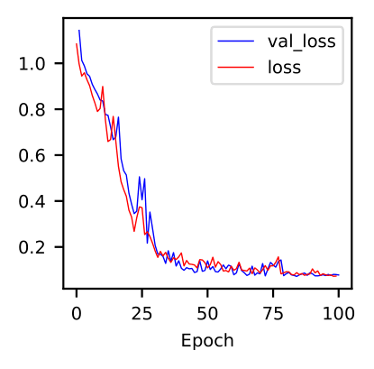

Vignette: example workflow
==========================

This vignette shows a complete pipeline for a small application of ``disperseNN2`` including instructions for the intermediate data-organizing steps. Some details referenced in the below vignette, e.g., descriptions of command line flags, are explained under :doc:`usage`. We recommend using a cluster node with 10s of CPUs and a GPU for the below analysis.

**Table of contents:**

:ref:`vignette_simulation`

:ref:`vignette_preprocessing`

:ref:`vignette_training`

:ref:`vignette_validation`

:ref:`vignette_empirical`

     

.. _vignette_simulation:

1. Simulation
-------------

For this demonstration we will analyze a population of *Internecivus raptus*. Let's assume we have independent estimates from previous studies for several parameters:

- the width of the species range is 78 km
- population density is 2.5 individuals per km\ :math:`^2`
- recombination rate is 1e-8 crossovers per bp per generation

With values for these nuisance parameters in hand we can design custom training simulations for inferring :math:`\sigma`. If our a priori expectation for :math:`\sigma` in this species is somewhere between 0.4 and 6, we will simulate dispersal rates in this range. 100 training simulations should suffice for this demonstration, plus 100 more for testing, so we need 200 total simulations.

Below is some bash code to run the simulations using ``square.slim``. If you haven't yet, first activate the ``disperseNN2`` conda env, and install ``SLiM``:

.. code-block:: console

                (.venv) $ conda activate disperseNN2

.. code-block:: console

                (.venv) $ mamba install slim==4.0.1 -c conda-forge

.. code-block:: console                         
                :linenos:                       
                                                
                (.venv) $ mkdir -p temp_wd/vignette/TreeSeqs
                (.venv) $ mkdir -p temp_wd/vignette/Targets
		(.venv) $ sigmas=$(python -c 'from scipy.stats import loguniform; import numpy; numpy.random.seed(seed=12345); print(*loguniform.rvs(0.4,6,size=200))')
                (.venv) $ for i in {1..200}; do \
                >             sigma=$(echo $sigmas | awk -v var="$i" '{print $var}'); \
		>             echo "slim -d SEED=$i -d sigma=$sigma -d K=2.5 -d r=1e-8 -d W=78 -d G=1e8 -d maxgens=1000 -d OUTNAME=\"'temp_wd/vignette/TreeSeqs/output'\" SLiM_recipes/square.slim" >> temp_wd/vignette/sim_commands.txt; \
		>             echo $sigma > temp_wd/vignette/Targets/target_$i.txt; \
		>             echo temp_wd/vignette/Targets/target_$i.txt >> temp_wd/vignette/target_list.txt; \
		>         done
		(.venv) $ num_threads=2 # change to number of available cores
		(.venv) $ parallel -j $num_threads < temp_wd/vignette/sim_commands.txt

Breaking down this pipeline one line at a time:

- L1 activates our conda environment
- L2 creates a new folder for the simulation output. The base folder ``temp_wd`` will contain all output from the current vignette.
- L3 creates another folder for the training targets.
- L4 draws random :math:`\sigma`\'s from a log-uniform distribution.
- L7 builds individual commands for simulations.
- L8 saves each :math:`\sigma` to it's own file.
- L9 creates a list of filepaths to the targets.
- L12 runs the simulation commands. If multiple cores are available, the number of threads used for this vignette can be increased (L11) to speed things up. In a real application, simulations should be distributed across many jobs on a computing cluster.

And to recapitate the tree sequences output by ``SLiM``:

.. code-block:: console

		(.venv) $ for i in {1..200}; do \
		>             echo "python -c 'import tskit,msprime; \
		>                              ts=tskit.load(\"temp_wd/vignette/TreeSeqs/output_$i.trees\"); \
		>		               Ne=len(ts.individuals()); \
		>		               demography = msprime.Demography.from_tree_sequence(ts); \
		>		               demography[1].initial_size = Ne; \
		>		               ts = msprime.sim_ancestry(initial_state=ts, recombination_rate=1e-8, demography=demography, start_time=ts.metadata[\"SLiM\"][\"cycle\"],random_seed=$i,); \
		>		               ts.dump(\"temp_wd/vignette/TreeSeqs/output_$i"_"recap.trees\")'" \
		>             >> temp_wd/vignette/recap_commands.txt; \
		>             echo temp_wd/vignette/TreeSeqs/output_$i"_"recap.trees >> temp_wd/vignette/tree_list.txt; \
		>         done   
		(.venv) $ parallel -j $num_threads < temp_wd/vignette/recap_commands.txt

		

.. _vignette_preprocessing:

2. Preprocessing
----------------

Next, we need to preprocess the input for ``disperseNN2``. But first we need to clean up our *I. raptus* metadata.

Let's pretend we want to take a subset of individuals from a particular geographic region, the "Scotian Shelf-East" region. Below is an example command that might be used to parse and reformat the metadata, but these steps will vary depending on the idiosyncracies of your particular dataset. 

.. code-block:: console

		(.venv) $ cat Examples/VCFs/iraptus_meta_full.txt | grep "Scotian Shelf - East" | sed s/"\t"/,/g > temp_wd/vignette/iraptus.csv

We provide a simple script for subsetting a VCF for a particular set of individuals, which also filters indels and non-variant sites:

.. code-block:: console

		(.venv) $ python Empirical/subset_vcf.py Examples/VCFs/iraptus_full.vcf.gz temp_wd/vignette/iraptus.csv temp_wd/vignette/iraptus.vcf 0 1 12345
		(.venv) $ gunzip temp_wd/vignette/iraptus.vcf.gz

The flags for ``Empirical/subset_vcf.py`` are:

1. path to input vcf (gzipped)
2. path to metadata (.csv)
3. output name
4. minimum read depth to retain a SNP (int)
5. minimum proportion of samples represented to keep a SNP (float)
6. random number seed (int)
		
Last, build a .locs file:

.. code-block:: console                                                                        
                                                                                            
                (.venv) $ count=$(cat temp_wd/vignette/iraptus.vcf | grep -v "##" | grep "#" | wc -w) 
                (.venv) $ for i in $(seq 10 $count); do \                                       
                >             id=$(cat temp_wd/vignette/iraptus.vcf | grep -v "##" | grep "#" | cut -f $i); \
                >             grep -w $id temp_wd/vignette/iraptus.csv; \
                >         done | cut -d "," -f 4,5 | sed s/","/"\t"/g > temp_wd/vignette/iraptus.locs 
		   
This filtering results in 1951 SNPs from 95 individuals. These values are included in our below ``disperseNN2`` preprocessing command:

.. code-block:: console
		
		(.venv) $ python disperseNN2.py \
		>                 --out temp_wd/vignette/output_dir \
		>	          --seed 12345 \
		>	          --preprocess \
		>	          --num_snps 1951 \
		>	          --n 95 \
		>	          --tree_list temp_wd/vignette/tree_list.txt \
		>	          --target_list temp_wd/vignette/target_list.txt \
		>	          --empirical temp_wd/vignette/iraptus \
		>	          --hold_out 100

   

		       

.. _vignette_training:

3. Training
-----------

In the below ``disperseNN2`` training command, we set ``pairs`` to 1000; this is the number of pairs of individuals from each training dataset that are included in the analysis, and we chose 1000 to reduce the memory requirement. The maximum number of pairs with 95 individuals would have been 4465. We've found that using 100 for ``--pairs_encode`` and ``--pairs_estimate`` works well, and further reduces memory. Don't forget to tack on the ``--gpu`` flag if GPUs are available.

.. code-block:: console

                (.venv) $ python disperseNN2.py \
		>                --out temp_wd/vignette/output_dir \
		> 		 --seed 12345 \
		> 		 --train \
		>                --max_epochs 100 \
		>                --validation_split 0.2 \
		>                --batch_size 10 \
		>                --learning_rate 1e-4 \
		>                --pairs 1000 \
		>                --pairs_encode 100 \
		>                --pairs_estimate 100 \
		>		 > temp_wd/vignette/output_dir/training_history_12345.txt

After the run completes, let's visualize the training history:

.. code-block:: console

                (.venv) $ python disperseNN2.py --plot_history temp_wd/vignette/output_dir/training_history_12345.txt
		

   Plot of training history. X-axis the training iteration, and Y-axis is mean squared error.

This plot shows that the validation loss decreases over time, without too much under- or over-fitting.
		

		       

.. _vignette_validation:

4. Validation
-------------

Next, we will validate the trained model on simulated test data. In a real application you should hold out datasets from training, but we haven't updated the disperseNN code to do this yet.

.. code-block:: console

                (.venv) $ python disperseNN2.py \
		>                --out temp_wd/vignette/output_dir \
                >                --seed 12345 \		
		>                --predict \
		>                --batch_size 10 \
		>                --pairs 1000 \
		>                --pairs_encode 100 \
		>                --pairs_estimate 100 \
		>                --num_pred 100

We visualized the predictions, ``temp_wd/vignette/output_dir/Test/predictions_12345.txt``, in R:
		
.. figure:: results_vignette.png
   :scale: 50 %
   :alt: results_plot

   Validation results. True :math:`\sigma` is on the x-axis and predicted values are on the y-axis. The dashed line is :math:`x=y`.
		       
The predictions are reasonably close to the expected values, meaning there is some signal for dispersal rate. The training run was successful.

.. However, we are currently underestimating towards the larger end of the :math:`\sigma` range. This might be alleviated by using (i) a larger training set, (ii) more generatinos spatial, (iii) larger sample size, or (iv) or more SNPs.

.. _vignette_empirical:

5. Empirical application
------------------------

Since we are satisfied with the performance of the model on the held-out test set, we can finally predict σ in our empirical data.

.. code-block:: console

		(.venv) $ python disperseNN2.py \
		>                --out temp_wd/vignette/output_dir \
                >                --seed 12345 \		
		>		 --predict \
		>		 --empirical temp_wd/vignette/iraptus \
		>		 --batch_size 10 \
		>                --pairs 1000 \
		>		 --pairs_encode 100 \
		>                --pairs_estimate 100 \
		>                --num_reps 10

The final empirical results are stored in: ``temp_wd/vignette/output_dir/empirical_12345.txt``.

.. code-block:: console

		(.venv) $ cat temp_wd/vignette/output_dir/empirical_12345.txt
		temp_wd/vignette/iraptus rep0 4.0292504657
		temp_wd/vignette/iraptus rep1 4.7502661752
		temp_wd/vignette/iraptus rep2 4.3643506614
		temp_wd/vignette/iraptus rep3 4.6555107812
		temp_wd/vignette/iraptus rep4 4.7846365925
		temp_wd/vignette/iraptus rep5 3.9105241623
		temp_wd/vignette/iraptus rep6 4.465856206
		temp_wd/vignette/iraptus rep7 3.2642763587
		temp_wd/vignette/iraptus rep8 3.3628482169
		temp_wd/vignette/iraptus rep9 4.3176748371

		

**Interpretation**.
The output, :math:`\sigma`, is an estimate for the standard deviation of the Gaussian dispersal kernel from our training simulations; in addition, the same parameter was used for the mating distance (and competition distance). Therefore, to get the distance to a random parent, i.e., effective :math:`\sigma`,  we would apply a posthoc correction of :math:`\sqrt{\frac{3}{2}} \times \sigma` (see original disperseNN paper for details). In this example, we trained with only 100 generations spatial, hence the dispersal rate estimate reflects demography in the recent past.

