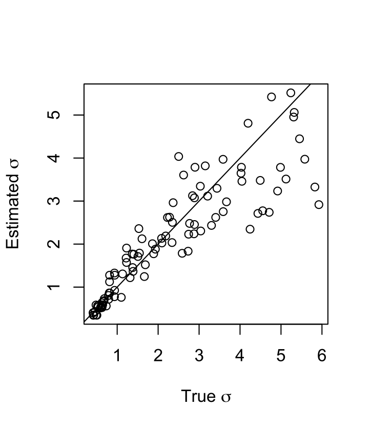

Vignette: example workflow
==========================

This vignette shows a complete pipeline for a small application of ``disperseNN2`` including instructions for the intermediate data-organizing steps. For details about individual command line flags, see :doc:`usage`.

**Table of contents:**

:ref:`vignette_simulation`

:ref:`vignette_preprocessing`

:ref:`vignette_training`

:ref:`vignette_validation`

:ref:`vignette_empirical`

     

.. _vignette_simulation:

1. Simulation
-------------

For this demonstration we will analyze a population of Internecivus raptus. Let's assume we have independent estimates from previous studies for the size of the species range and the population density: :math:`48 \times 48` km\ :math:`^2`, and 6 individuals per km\ :math:`^2`, respectively. With values for these nuisance parameters in hand we can design custom training simulations for inferring :math:`\sigma`. If our a priori expectation for :math:`\sigma` in this species is somewhere between 0.2 and 1.5, we will simulate dispersal rates in this range.

Below is some bash code to run the simulations using ``bat20.slim``. 

.. code-block:: bash
   :linenos:

   mkdir -p temp_wd/vignette/TreeSeqs
   mkdir -p temp_wd/vignette/Targets		
   sigmas=$(python -c 'from scipy.stats import loguniform; print(*loguniform.rvs(0.2,1.5,size=100))')
   for i in {1..100}
   do
       sigma=$(echo $sigmas | awk -v var="$i" '{print $var}')
       echo "slim -d SEED=$i -d sigma=$sigma -d K=6 -d mu=0 -d r=1e-8 -d W=48 -d G=1e8 -d maxgens=100 -d OUTNAME=\"'temp_wd/vignette/TreeSeqs/output'\" SLiM_recipes/bat20.slim" >> temp_wd/vignette/sim_commands.txt
       echo $sigma > temp_wd/vignette/Targets/target_$i.txt
       echo temp_wd/vignette/Targets/target_$i.txt >> temp_wd/vignette/target_list.txt
   done
   parallel -j 2 < temp_wd/vignette/sim_commands.txt

Breaking down this pipeline one line at a time:

- L1 creates a new folder where the output from the vignette will be saved.
- L2 creates another folder for the training targets.
- L3 draws random :math:`\sigma`\'s from a log-uniform distribution.
- L7 builds individual commands for simulations.
- L8 saves each :math:`\sigma` to it's own file.
- L9 creates a list of filepaths to the targets.
- L11 runs the simulation commands. Here, we use GNU ``parallel`` with 2 threads; if multiple cores are available, the number of threads used for this vignette can be increased to speed things up. In a real application, simulations should probably be distributed across many jobs on computing cluster.

And to recapitate the tree sequences output by ``SLiM``:

.. code-block:: bash

		for i in {1..100}
		do
		    echo "python -c 'import tskit,msprime; \
		                     ts=tskit.load(\"temp_wd/vignette/TreeSeqs/output_$i.trees\"); \
				     Ne=len(ts.individuals()); \
				     demography = msprime.Demography.from_tree_sequence(ts); \
				     demography[1].initial_size = Ne; \
				     ts = msprime.sim_ancestry(initial_state=ts, recombination_rate=1e-8, demography=demography, start_time=ts.metadata[\"SLiM\"][\"cycle\"],random_seed=$i,); \
				     ts.dump(\"temp_wd/vignette/TreeSeqs/output_$i"_"recap.trees\")'" \
		    >> temp_wd/vignette/recap_commands.txt
		    echo temp_wd/vignette/TreeSeqs/output_$i"_"recap.trees >> temp_wd/vignette/tree_list.txt
		done   
		parallel -j 2 < temp_wd/vignette/recap_commands.txt

.. _vignette_preprocessing:

2. Preprocessing
----------------

Next, we preprocess the input for ``disperseNN2``. Assume we have a sample of 97 individuals from different locations, and 25,000 SNPs.

We will take 10 repeated samples from each tree sequences, to get a total of 1,000 training datasets (100 tree sequences, 10 samples from each). Our strategy for this is to use 10 different preprocess commands, each with a different random number seed.

.. code-block:: bash
		
		for i in {1..10}
		do
		    echo "python disperseNN2.py \
		                 --out temp_wd/vignette/output_dir \
				 --preprocess \
				 --num_samples 10 \
				 --num_snps 25000 \
				 --n 97 \
				 --seed $i \
				 --edge_width 1.5 \
				 --tree_list temp_wd/vignette/tree_list.txt \
				 --target_list temp_wd/vignette/target_list.txt" \
		    >> temp_wd/vignette/preprocess_commands.txt
		done
		parallel -j 2 < temp_wd/vignette/preprocess_commands.txt

.. note::

   Here we chose to sample away from the habitat edges by 1.5km. This is because the simulation model artifically reduces survival probability near the edges, within distance :math:`\sigma`, roughly. Since the largest :math:`\sigma` we explored is 1.5, we simply cropped away this width from each edge.

		       

.. _vignette_training:

3. Training
-----------

In the below ``disperseNN2`` training command, we set the number of pairs to 100; this is the number of pairs of individuals from each training dataset that are included in the analysis. In a real application you would probably want to use more pairs, e.g. with a sample size of 97 the number of available pairs is 4656. However, the value for ``pairs_encode`` might be ok to leave at 100, as this flg controls how many pairs are included in the gradient in the encoder portion of the neural network, and it tends to work well even with a subset of pairs. Likewise, the ``pairs_estimate`` flag might use a subset of pairs. Different values for these hyperparameters should be explored in a real analysis.

While our preprocessing step saved 25,000 SNPs from each tree sequence, we're going to train with only 5,000 SNPs. This will work well for our goals and should be a bit faster and require less memory.

.. code-block:: bash

                python disperseNN2.py \
                       --out temp_wd/vignette/output_dir \
                       --train \
                       --preprocessed \
                       --num_snps 5000 \
                       --max_epochs 10 \
                       --validation_split 0.2 \
                       --batch_size 10 \
                       --threads 1 \
                       --seed 12345 \
                       --n 97 \
                       --learning_rate 1e-4 \
                       --pairs 100 \
                       --pairs_encode 100 \
                       --pairs_estimate 100 \
                       > temp_wd/vignette/output_dir/training_history.txt \
		       # do we need the "n" flag?

# this command trains! Using the standard disperseNN simulations params
(disperseNN) chriscs@poppy:~/Testing_disperseNN2/disperseNN2$ python disperseNN2.py        --out temp_wd/vignette/output_dir_1k/        --train        --preprocessed        --num_snps 5000       
 --max_epochs 10        --validation_split 0.2        --batch_size 10        --threads 1        --seed 12345        --n 40        --learning_rate 1e-4        --pairs 100        --pairs_encode 100        --pairs_estimate 100

.. _vignette_validation:

4. Validation
-------------

Next, we will validate the trained model on simulated test data. In a real application you should hold out datasets from training, but we haven't updated the disperseNN code to do this yet.

.. code-block:: bash

                python disperseNN2.py \
                       --out temp_wd/vignette/output_dir \
                       --predict \
                       --preprocessed \
                       --num_snps 25000 \
                       --batch_size 1 \
                       --threads 1 \
                       --n 97 \
                       --seed 12345 \
                       --pairs 4656 \
                       --pairs_encode 45 \
                       --pairs_estimate 45 \
                       --load_weights temp_wd/vignette/output_dir/out_12345_model.hdf5 \
                       --num_pred 10

   This is the caption of the figure (a simple paragraph).
		       
The results show that the training run went well: specifically, the predictions fell close to the expected values, meaning there is some signal coming through.

.. _vignette_empirical:

5. Empirical application
------------------------

If we are satisfied with the performance of the model on the held-out test set, we can run prepare our empirical VCF for inference with disperseNN. This means applying basic filters (e.g. removing indels and non-variants sites) on whatever set of individuals that we want to analyze. Separately, we want a .locs file with the same prefix as the .vcf.

For demonstration purposes, let's say we want to take a subset of individuals from a particular geographic region, the Scotian Shelf region. Furthermore, we want to include only a single individual per sampling location; this is important because individuals did not have identical locations in the training simulations, which might trip up the neural network. Below are some example commands that might be used to parse the metadata, but these steps will certainly be different for other empirical tables.

.. code-block:: bash

		# [these commands are gross; but I want to eventually switch over to simulated data, so these steps will change]
		cat Examples/VCFs/iraptus_meta_full.txt | grep "Scotian Shelf - East" | cut -f 4,5 | sort | uniq > temp_wd/templocs
		count=$(wc -l temp_wd/templocs | awk '{print $1}')
		for i in $(seq 1 $count); do locs=$(head -$i temp_wd/templocs | tail -1); lat=$(echo $locs | awk '{print $1}'); long=$(echo $locs | awk '{print $2}'); grep $lat Examples/VCFs/iraptus_meta_full.txt | awk -v coord=$long '$5 == coord' | shuf | head -1; done > temp_wd/iraptus_meta.txt
		cat temp_wd/iraptus_meta.txt  | sed s/"\t"/,/g > temp_wd/iraptus.csv

We provide a simple python script for subsetting a VCF for a particular set of individuals, which also filters indels and non-variant sites.

.. code-block:: bash

		python Empirical/subset_vcf.py Examples/VCFs/iraptus_full.vcf.gz temp_wd/iraptus.csv temp_wd/iraptus.vcf 0 1

Last, build a .locs file:

.. code-block:: bash

		count=$(zcat temp_wd/iraptus.vcf.gz | grep -v "##" | grep "#" | wc -w)
		for i in $(seq 10 $count); do id=$(zcat temp_wd/iraptus.vcf.gz | grep -v "##" | grep "#" | cut -f $i); grep -w $id temp_wd/iraptus.csv; done | cut -d "," -f 4,5 | sed s/","/"\t"/g > temp_wd/iraptus.locs
		gunzip temp_wd/iraptus.vcf.gz

Finally, we can predict predict σ from the subsetted VCF (should take less than 30s to run):
		

.. code-block:: bash

		python disperseNN2.py \
                       --out temp_wd/vignette/output_dir \
		       --predict \
		       --empirical Examples/VCFs/halibut \
		       --num_snps 5000 \
		       --batch_size 1 \
		       --threads 1 \
		       --n 10 \
		       --seed 12345 \
                       --pairs 45 \
		       --pairs_encode 45 \
                       --pairs_estimate 45 \
                       --load_weights temp_wd/vignette/output_dir/out_12345_model.hdf5 \
                       --num_pred 1

Note: num_reps, here, specifies how many bootstrap replicates to perform, that is, how many seperate draws of 1000 SNPs to use as inputs for prediction.

The final empirical results are stored in: temp_wd/out3_predictions.txt

temp_wd/iraptus_0 0.4790744392
temp_wd/iraptus_1 0.4782159438
temp_wd/iraptus_2 0.4752711311
temp_wd/iraptus_3 0.4757308299
temp_wd/iraptus_4 0.4763104592
temp_wd/iraptus_5 0.4740976943
temp_wd/iraptus_6 0.4711097443
temp_wd/iraptus_7 0.4765035801
temp_wd/iraptus_8 0.4711986949
temp_wd/iraptus_9 0.4780693254

To Do:

- work on empirical pipeline in disperseNN code
- separate training and test sims internally, automatically, using disperseNN.
